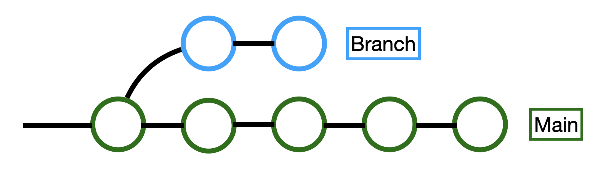

<h1>Basic</h1>
<h2>1. Initialization</h2>   

```
git init
```
git start to view this directory
<br><br>

<h2>2. Add File</h2>

```
git add 파일명
git add 파일명1 파일명2
git add .
```
save the file's current state<br>
(e.g. `git add './how to use Git.md'`)
<br><br>

<h2>3. File Commit (with memo)</h2>

```
git commit -m '메모 내용'
```
File commit to your repository and memo about file<br>
if inquiry the history, memo will help<br>
(e.g. `git commit -m 'this is git manual`)<br><br>

**When you save the file**<br>
'2. Add File' and '3. File Commit' are fulfil together!

<br><br>
<h1>Branch</h1>
<h2>Make branch</h2>

```
git branch 브랜치명
```
make to most recent commit's copy
<br><br>

<h2>Switch branch</h2>

```
git switch 브랜치명
git switch main
```
move to recent commit's copy file<br>
type terminal `git status`, you can recognize what branch you choose
<br><br>

this status, your work is always saving at branch

<br><br><br><br>


<h1>Additional Command</h1>
<h2>Status</h2>

```
git status
```
<br>
<h2>Check about Commit breakdown</h2>

```
git log --all --oneline
git log --all --oneline --graph
```
<br>
<h2>Check different of commit file and current file</h2>

```
git difftool
```
Compare *commit file* and *current file* using Vim<br>
`:qa`: quit Vim editor
<br><br>
```
git difftool 커밋아이디
```
Compare *specific commit file* and *current file*<br><br>
```
git difftool 커밋아이디1 커밋아이디2
```
Compare *specific commit file1* and *specific commit file2*<br><br>

<h3>Open file to VSCode instead of Vim</h3>

```
git config --global diff.tool vscode git config --global difftool.vscode.cmd 'code --wait --diff $LOCAL $REMOTE'
```
<br><br>


<h2>Convenient VSCode Extension</h2>

`gitlens` Check Git breakdown(who, when, why change this code)<br>
`git history`<br>
`git graph` upgrade version of 'git diff', *Source Control*(at left nav bar), at the top of nav bar *View Git Graph* <br>